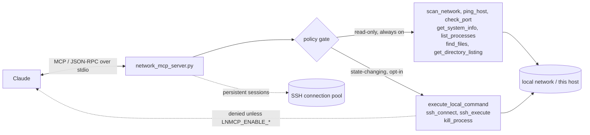

# Local Network MCP Server

[](https://github.com/ahmed-hashim-pro/local-network-mcp/actions/workflows/ci.yml) [](LICENSE)

A Model Context Protocol (MCP) server that allows Claude to interact with your local network, execute local shell commands, monitor system resources, and manage remote devices via SSH.

It turns "can you check why the Raspberry Pi dropped off the network" into a workflow the agent executes itself: `scan_network` → `ping_host` → `ssh_connect` → `ssh_execute` → diagnosis. Persistent SSH sessions mean the agent connects once and runs multi-step remote workflows (inspect logs, restart a service, verify) in a single conversation.

## Demo


*Illustrative walkthrough — Claude discovers a device on the local network, opens a persistent
SSH session, and diagnoses the fault end to end. Reconstructed for the README; not a recording
of a live run.*

## Security model

An LLM decides when these tools run, which makes "the operator will be careful"
useless as a control. So the four tools that run commands or change state are
**off unless you turn them on**:

| Tool | Can do | Default | Opt in with |
| --- | --- | --- | --- |
| `execute_local_command` | run any local shell command | **denied** | `LNMCP_ENABLE_EXEC=1` |
| `ssh_connect` | open an authenticated SSH session | **denied** | `LNMCP_ENABLE_SSH_EXEC=1` |
| `ssh_execute` | run any command on a remote host | **denied** | `LNMCP_ENABLE_SSH_EXEC=1` |
| `kill_process` | terminate a process by PID | **denied** | `LNMCP_ENABLE_KILL=1` |

Everything else — discovery, ping, port checks, system stats, process *listing*,
directory *listing*, file search — is read-only and always available. Out of the
box this server is a diagnostic instrument that cannot change anything.

Disabled tools are also advertised as disabled in the tool listing, so the agent
knows not to spend a turn on them. A refusal names the variable that would allow
the call:

```json
{
  "success": false,
  "policy": "default-deny",
  "tool": "execute_local_command",
  "error": "execute_local_command is disabled by default because it can run commands or change state. Set LNMCP_ENABLE_EXEC=1 in the server's environment (the \"env\" block of your MCP client config) and restart the server to enable it."
}
```

Two properties make this a boundary rather than a suggestion:

- **The switch is not reachable from a tool argument.** It lives in the server's
  environment, which you set in the client config. `execute_local_command` does
  take an `env` parameter, but that is applied to the child process — passing
  `env={"LNMCP_ENABLE_EXEC": "1"}` enables nothing. The agent cannot turn its own
  guardrails off, and there is a test for exactly that.
- **The gate sits at each tool's own entry point**, not at the dispatch layer, so
  an internal caller cannot route around it. `ssh_execute` opens its session by
  calling `ssh_connect`, and both check the gate, so no SSH session is opened
  while `LNMCP_ENABLE_SSH_EXEC` is unset.

### What this does not do

The limits matter more than the feature list:

- Once enabled, `execute_local_command` runs **arbitrary** shell commands with the
  permissions of the server process. There is no allowlist and no sandbox. The
  opt-in is a deliberate per-tool decision, nothing more.
- SSH host keys are checked against known_hosts (see
  [SSH host keys](#ssh-host-keys)). An unknown host is refused unless you opt
  into trust on first use, and then its first contact is unverified.
- Tool calls are not audit-logged.

Run it against machines you own.

## Architecture



A single stdio server. `list_tools` advertises the catalogue and stamps disabled
tools; `call_tool` dispatches by name. Each state-changing function re-checks the
policy itself before doing any work. SSH connections are pooled by
`user@host:port` so a multi-step remote workflow authenticates once.


## Features

### Local System Tools
- **Execute Local Commands**: Run shell commands on your local machine
- **System Information**: Get CPU, memory, disk, and network details
- **Process Management**: List, monitor, and kill processes
- **Environment Variables**: View and filter environment variables
- **Directory Operations**: List, search, and navigate directories
- **Disk Usage**: Monitor disk space usage
- **File Search**: Find files matching patterns
- **Network Connections**: Monitor active network connections

### Network Tools
- **Get Local IP**: Find your machine's IP address and network range
- **Network Scanning**: Discover all active devices on your local network
- **Ping Hosts**: Check if specific devices are online
- **Port Checking**: See if specific ports are open on any device
- **Port Scanning**: Scan multiple ports on any device at once

### SSH Tools
- **SSH Connect**: Establish persistent SSH connections to remote devices
- **SSH Execute**: Run commands on remote devices via SSH
- **SSH Disconnect**: Close SSH connections
- **SSH List Connections**: View all active SSH sessions

## Installation

Python 3.11+.

```bash
git clone https://github.com/ahmed-hashim-pro/local-network-mcp.git
cd local-network-mcp

python3 -m venv .venv
source .venv/bin/activate        # Windows: .venv\Scripts\activate
pip install -e .
```

A virtualenv is not optional on most systems: a Homebrew or system Python will
refuse a bare `pip install` with `error: externally-managed-environment` (PEP 668).

Verify the install — this prints the policy state and exits, unlike starting the
server, which waits on stdin for an MCP client and will look like it has hung:

```bash
python -c "import network_mcp_server as s; print({t: s.is_tool_enabled(t) for t in s.DESTRUCTIVE_TOOLS})"
# {'execute_local_command': False, 'ssh_connect': False, 'ssh_execute': False, 'kill_process': False}
```

Run the tests (no credentials, no network, no reachable hosts required):

```bash
pip install -e ".[dev]"
pytest
```

## Configuration

Add this server to your Claude Desktop configuration:

**macOS**: `~/Library/Application Support/Claude/claude_desktop_config.json`

**Windows**: `%APPDATA%/Claude/claude_desktop_config.json`

```json
{
  "mcpServers": {
    "local-network": {
      "command": "/path/to/local-network-mcp/.venv/bin/python",
      "args": ["/path/to/local-network-mcp/network_mcp_server.py"]
    }
  }
}
```

That configuration is read-only: the agent can discover and diagnose, but not
change anything. To enable a state-changing tool, add it to an `env` block — and
add only the ones you actually want:

```json
{
  "mcpServers": {
    "local-network": {
      "command": "/path/to/local-network-mcp/.venv/bin/python",
      "args": ["/path/to/local-network-mcp/network_mcp_server.py"],
      "env": {
        "LNMCP_ENABLE_SSH_EXEC": "1"
      }
    }
  }
}
```

(A template is provided in `claude_desktop_config.json` — update the path to where you cloned the repo.)

Or register with Claude Code:

```bash
claude mcp add local-network -- /path/to/local-network-mcp/.venv/bin/python \
  /path/to/local-network-mcp/network_mcp_server.py
```

After adding the configuration, restart Claude Desktop.

## Usage Examples

> The first three groups below use tools that are **denied by default**.
> See [Security model](#security-model) for the opt-in.

### Local Command Execution
- "Execute 'ls -la' on my local machine"
- "Run 'git status' in ~/projects"
- "Execute 'npm install' with a 60 second timeout"
- "Run 'python script.py' with custom environment variables"

### System Monitoring
- "What's my system information?"
- "Show me CPU and memory usage"
- "List all running processes"
- "Show me processes using the most CPU"
- "What processes are running that match 'python'?"
- "Show my environment variables"
- "Find all PATH-related environment variables"

### Process Management
- "Kill process with PID 12345"
- "Force kill the stuck process 9876"
- "List all Python processes"

### Directory & File Operations
- "List files in ~/Documents"
- "Show me all files in the current directory recursively"
- "Find all Python files in my projects folder"
- "Search for '*.log' files in /var/log"
- "What's the disk usage of my home directory?"
- "Show hidden files in my home directory"

### Network Monitoring
- "Show all active network connections"
- "List all TCP connections"
- "What ports are currently listening on my machine?"

### Network Operations
- "What devices are on my network?"
- "Is 192.168.1.100 online?"
- "Check if port 8080 is open on my server"
- "Scan common ports on 192.168.1.50"
- "What's my local IP address?"

### SSH Operations
- "Connect to my Raspberry Pi at 192.168.1.100 with username pi"
- "Execute 'df -h' on 192.168.1.100"
- "Check disk space on my server"
- "List running processes on the remote machine"
- "Show all active SSH connections"
- "Disconnect from 192.168.1.100"

## Available Tools

### Local System Tools

#### `execute_local_command`
**Denied by default** — opt in with `LNMCP_ENABLE_EXEC=1`.
Execute shell commands on your local machine with full control.

**Parameters:**
- `command` (required): Shell command to execute
- `shell` (optional): Use shell interpretation (default: true)
- `timeout` (optional): Command timeout in seconds (default: 30)
- `cwd` (optional): Working directory for execution
- `env` (optional): Additional environment variables

**Example:**
```
Execute 'git status' in ~/projects/myapp
```

#### `get_system_info`
Get comprehensive system information including platform, CPU, memory, disk, and network details.

**Example:**
```
Show me my system information
```

#### `list_processes`
List running processes with CPU and memory usage, sorted by CPU usage.

**Parameters:**
- `filter_name` (optional): Filter processes by name
- `limit` (optional): Maximum number of results (default: 50)

**Example:**
```
List all Python processes
Show me the top 20 processes by CPU usage
```

#### `kill_process`
**Denied by default** — opt in with `LNMCP_ENABLE_KILL=1`.
Terminate or force kill a process by PID.

**Parameters:**
- `pid` (required): Process ID to kill
- `force` (optional): Use SIGKILL instead of SIGTERM (default: false)

**Example:**
```
Kill process 12345
Force kill process 9876
```

#### `get_environment_variables`
View system environment variables with optional filtering.

**Parameters:**
- `filter_key` (optional): Filter by key name

**Example:**
```
Show all environment variables
Find PATH-related environment variables
```

#### `get_directory_listing`
List directory contents with detailed file information.

**Parameters:**
- `path` (optional): Directory path (default: current directory)
- `recursive` (optional): List recursively (default: false)
- `show_hidden` (optional): Show hidden files (default: false)
- `max_depth` (optional): Maximum recursion depth (default: 3)

**Example:**
```
List files in ~/Documents
Show all files recursively in my projects folder
```

#### `get_disk_usage`
Get disk usage information for any path.

**Parameters:**
- `path` (optional): Path to check (default: /)

**Example:**
```
What's the disk usage of my home directory?
Show disk space for /var
```

#### `find_files`
Search for files matching a pattern.

**Parameters:**
- `path` (required): Starting directory
- `pattern` (required): File pattern (e.g., "*.py", "test*.txt")
- `recursive` (optional): Search recursively (default: true)
- `file_type` (optional): Filter by "file" or "directory"
- `max_results` (optional): Maximum results (default: 100)

**Example:**
```
Find all Python files in ~/projects
Search for log files in /var/log
```

#### `get_network_connections`
View active network connections and listening ports.

**Parameters:**
- `filter_type` (optional): Filter by "tcp" or "udp"

**Example:**
```
Show all TCP connections
What ports are listening on my machine?
```

## SSH Authentication

The server supports two authentication methods:

### 1. Password Authentication
```python
# Claude will prompt for credentials
"Connect to 192.168.1.100 with username admin and password mypassword"
```

### 2. SSH Key Authentication
```python
# Using SSH key file
"Connect to 192.168.1.100 with username admin using key ~/.ssh/id_rsa"
```

## SSH host keys

`ssh_connect` (and `ssh_execute`, which connects through it) verifies the
server's host key before sending any credentials. Keys are read from, in this
order:

1. `~/.ssh/known_hosts`
2. `/etc/ssh/ssh_known_hosts`
3. this server's own file, `~/.config/local-network-mcp/known_hosts`
   (`$XDG_CONFIG_HOME/local-network-mcp/known_hosts` when that is set, or the
   path in `LNMCP_SSH_KNOWN_HOSTS`)

| Situation | Result |
| --- | --- |
| Host known, key matches | connects |
| Host known, key differs (or is of another type) | **refused, always**. The error shows both fingerprints and the `ssh-keygen -R` command to remove a stale entry |
| Host unknown | **refused by default**. The error shows the presented fingerprint |
| Host unknown, `LNMCP_SSH_TRUST_ON_FIRST_USE=1` | connects and records the key in this server's own file |

The simplest way to make a host known is to connect to it once with `ssh` and
check the fingerprint it shows you. Hosts on a non-standard port are stored as
`[host]:port`, the same as OpenSSH.

Trust on first use writes only to the server's own file, never to your
`~/.ssh/known_hosts`. An agent-driven first contact is unverified, and keeping
it out of the file your `ssh`, `git` and other tools rely on means it cannot
quietly become trusted elsewhere. It also keeps every key this server accepted
in one place you can read or delete. Keys recorded there stay trusted after you
turn trust on first use off; delete the file (or the line) to forget them.

## SSH Connection Management

The server maintains persistent SSH connections for better performance:
- Connections are reused across multiple command executions
- No need to reconnect for each command
- Automatic connection recovery if a connection drops
- Manual disconnect when done

## Operational notes

The enforced policy is described under [Security model](#security-model) above.
These are the operational caveats that sit alongside it:

- Enabled commands run with the permissions of the server process. Run it as a
  user with the least privilege that still does the job — not as root.
- You need permission to scan the network you point it at, and scanning may trip
  intrusion detection on a corporate LAN.
- Prefer SSH keys over passwords. Credentials passed as tool arguments are held
  in memory for the life of the pooled connection and are never written to disk,
  but a key file that Paramiko reads is still the safer path.
- Leave `LNMCP_SSH_TRUST_ON_FIRST_USE` unset on a network you do not control.
  With it set, the first connection to a host accepts whatever key is presented.

## Common Local Commands

### System Information
- `uname -a` - System information
- `hostname` - Get hostname
- `uptime` - System uptime
- `df -h` - Disk usage
- `free -h` - Memory usage (Linux)
- `top -l 1` - CPU snapshot (macOS)

### Process Management
- `ps aux` - List all processes
- `htop` - Interactive process viewer
- `lsof` - List open files

### File Operations
- `ls -la /path` - List files
- `cat /path/to/file` - Read file contents
- `pwd` - Current directory
- `du -sh /path` - Directory size
- `find /path -name "*.txt"` - Find files

### Network Operations
- `ifconfig` or `ip addr` - Network interfaces
- `netstat -an` - Network connections
- `lsof -i` - Network files
- `ping -c 4 google.com` - Test connectivity

### Development Commands
- `git status` - Git repository status
- `npm install` - Install Node.js packages
- `python --version` - Check Python version
- `docker ps` - List Docker containers

## Troubleshooting

### Server Issues
1. Check that Python is in your PATH
2. Verify the full path in the config file
3. Check Claude Desktop logs
4. Ensure you have required permissions
5. Try running the script manually first
6. Install missing dependencies: `pip install -r requirements.txt`

### Command Execution Issues
1. Verify you have permissions to execute the command
2. Check if the command exists in PATH
3. Try running the command manually in terminal
4. Increase timeout for long-running commands
5. Check working directory is correct
6. Verify environment variables are set properly

### SSH Connection Issues
1. Verify the host is reachable (`ping_host` tool)
2. Check if SSH port (22) is open (`check_port` tool)
3. Verify username and credentials
4. Check SSH server is running on target
5. Ensure firewall allows SSH connections
6. For key auth, check key file permissions (should be 600)
7. "not in any known_hosts file": the host key is unknown. See
   [SSH host keys](#ssh-host-keys)
8. "does not match the one in known_hosts": the host key changed. Find out why
   before removing the old entry

### Common Error Messages
- **"Command not found"**: Command not in PATH or doesn't exist
- **"Permission denied"**: Insufficient permissions to execute
- **"Timeout"**: Command took too long, increase timeout value
- **"Authentication failed"**: Wrong SSH username/password or key
- **"Connection refused"**: SSH server not running or firewall blocking

## Requirements

- Python 3.11+
- `mcp==1.29.1` — pinned to the 1.x line; 2.x removed the low-level
  `Server.list_tools()` / `call_tool()` decorators this server is built on
- `paramiko==5.0.0` (SSH), `psutil==7.2.2` (system monitoring)
- Network access permission for the range you scan
- SSH access to target devices, for the remote tools

## Example Workflows

### Local System Management
```
1. Check system resources
   "Show me my system information"

2. Monitor processes
   "List all running processes"

3. Find resource-heavy processes
   "Show me the top 10 processes by CPU"

4. Kill problematic process
   "Kill process 12345"

5. Check disk space
   "What's my disk usage?"
```

### Remote Server Management
```
1. Scan your network to find devices
   "Scan my network"

2. Check if SSH is available
   "Check if port 22 is open on 192.168.1.100"

3. Connect to the device
   "Connect to 192.168.1.100 with username pi"

4. Execute commands
   "Show disk space on 192.168.1.100"
   "List running processes on 192.168.1.100"

5. When done, disconnect
   "Disconnect from 192.168.1.100"
```

### Development Workflow
```
1. Check project status
   "Execute 'git status' in ~/projects/myapp"

2. Run tests
   "Execute 'npm test' in my project directory with 120s timeout"

3. Monitor logs
   "Find all log files in my project"
   "Execute 'tail -n 50 app.log' in my project"

4. Check processes
   "List all node processes"
```

## Performance Notes

- Network scanning can take 30-60 seconds for full range (254 IPs)
- Process listing is fast but may return many results
- File search with recursive option can be slow on large directories
- SSH connections are persistent and reused for better performance
- Command timeouts prevent hanging on stuck commands

## Roadmap

- Command allowlist/denylist mode for `execute_local_command`, narrowing the
  current all-or-nothing opt-in
- An audit log of every tool call, so an enabled server is reviewable
- Structured JSON tool outputs alongside the current text responses
- Configurable scan ranges and rate limiting for `scan_network`
- Per-tool timeout and output-size caps
- Port the low-level server to the `mcp` 2.x API (currently pinned to `mcp<2`)

## Why this exists

I wanted an agent that could actually diagnose a device on my LAN rather than
tell me which commands to type — "why did the Raspberry Pi drop off the network"
answered by `scan_network` → `ping_host` → `ssh_connect` → `ssh_execute`, with
the SSH session held open across the whole investigation instead of re-dialling
per command.

Building it surfaced the more interesting problem. An MCP server is a set of
capabilities handed to a non-deterministic caller, and the usual answer —
document the risk and trust the operator — does not survive contact with that
fact: the operator is not the one choosing when `rm -rf` runs. The design
question is which capabilities are safe to expose *by default*, and what an
opt-in has to look like so the model cannot grant it to itself. That is why the
switch lives in the server's environment rather than in a tool argument, why the
check sits at each function's own entry point rather than at the dispatch layer,
and why the tests assert the refusal rather than the execution.

The [Security model](#security-model) section is also honest about where the
boundary stops: once enabled, `execute_local_command` is still arbitrary
execution. A guardrail worth having is one whose limits you can state precisely.

## License

MIT — see [LICENSE](LICENSE).
